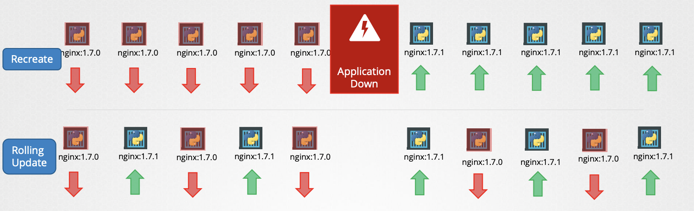

Deployment Strategy
- Recreate : N개를 먼저 끄고 N개를 키기
- RollingUpdate : 1개 준비되면 1개 끄고를 N번(전체) 반복



```shell
k apply -f deployment-definition.yaml


k set image deployment/nginx-deployment nginx-container=nginx=1.9.1

k rollout status deploy/nginx-deployment

k rollout restart deploy/nginx-deployment # Rollou

k rollout history deployment/nginx-deployment

k rollout undo d # Rollback
```

```yaml
---
apiVersion: apps/v1
kind: Deployment
metadata:
  name: myapp-deployment
  labels:
    app: myapp
    type: front-end
spec:
  replics: 3
  selector:
    matchLabels:
      type: front-end
  template:
    metadata:
      name: my-app
      type: front-end
    spec:
      containers:
      - name: nginx-container
        iamge: nginx:1.7.1
```