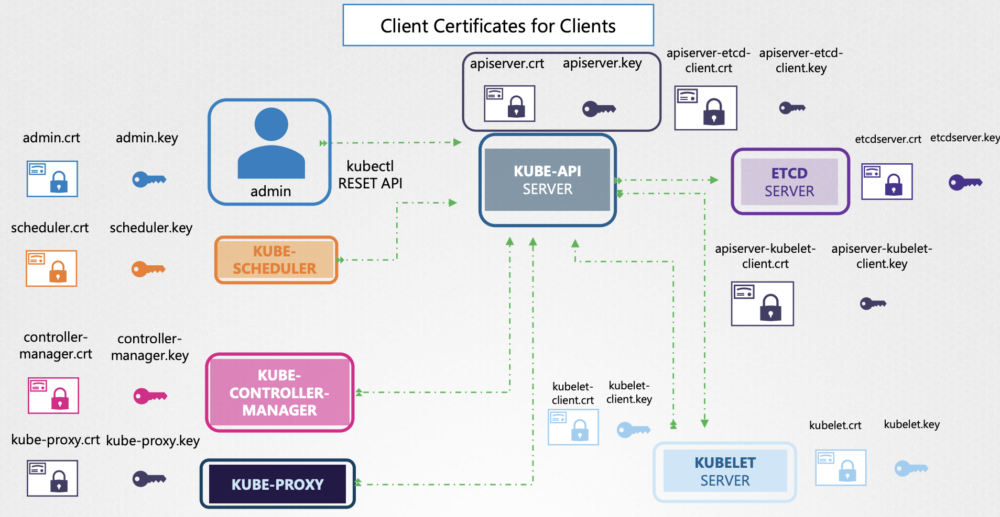
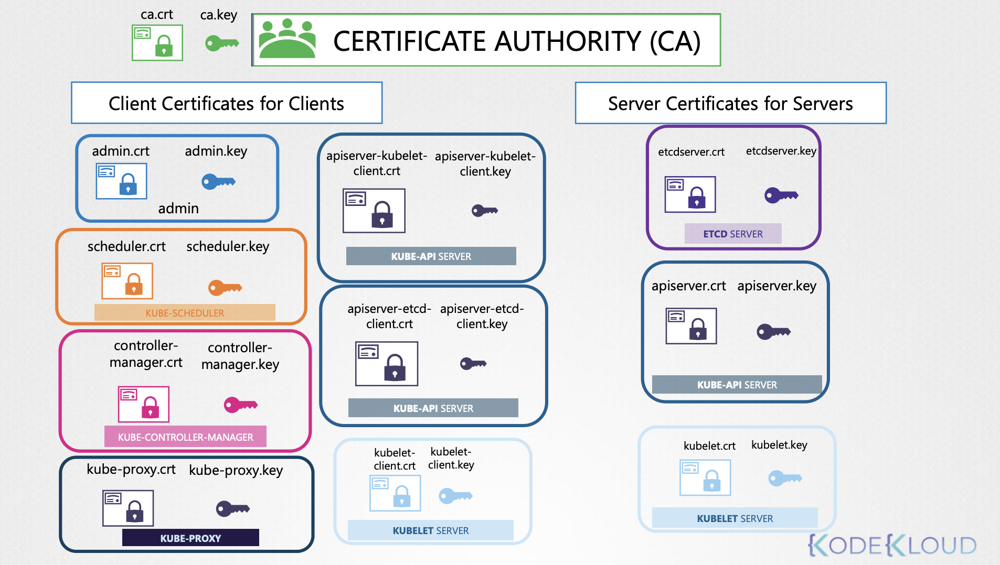

## Core Concepts

- Who can access?
- What can they do?

### Who can access?

1. Files - username and password.
2. Files - username and token.
3. Certificates
4. External Authentication Provider (LDAP)
5. Service Accounts

### What can they do?

1. RBAC Authorization
2. ABAC Authorization
3. Node Authentication
4. Webhook Mode

## Tech.

### Accounts

1. `User` is creted for admin & developer

```shell
kubectl create user user1
kubectl list users
```

2. `Service Accounts` is created for bots & application.

```shell
kubectl create serviceaccount sa1
kubectl get serviceaccount
```

### Auth Mecahnisms - Files - username and password.

- `user-details.csv`

```csv
password123,user1,u0001
password123,user2,u0002
password123,user3,u0003
password123,user4,u0004
paasword123,user5,u0005,group1
paasword123,user6,u0006,group2
paasword123,user7,u0007,group3
```

- `kube-apiserver.service` use `--basic-auth-file` option.

```shell
ExecStart=/usr/local/bin/kube-apiserver  \\
    --advertise-adrress=$(INTERNAL_IP)   \\
    --allow-privileged=true              \\
    --apiserver-count=3                  \\
    --authorization-mode=Node,RBAC       \\
    --bind-adrress=0.0.0.0               \\
    --enable-swagger-ui=true             \\
    --etcd-server=https://127.0.0.1:2379 \\
    --event-ttl=1h                       \\
    --runtime-config=api/all             \\
    --service-cluster-ip-rangle=10.32.0.0/24 \\
    --service-node-port-range=30000-32767    \\
    --v=2                                    \\
    --basic-auth-file=user-details.cvs
```

- /etc/kubrernetes/manifests/kube-apiserver.yaml

```yaml
apiVersion: v1
kind: Pod
metadata:
  creationTimestamp: null
  name: kube-apiserver
  namespace: kube-system
spec:
  containers:
    - command:
        - kube-apiserver
        - --authorization-mode=Node,RBAC
        - --advertise-adrress=127.17.0.107
        - --allow-privileged=true
        - --enable-admission-plugins=NodeRestriction
        - --enable-bootstrap-token-auth=true
      image: k8s.gcr.io/kube-apiserver-amd64:v1.11.3
      name: kube-apiserver
```

### Auth Mecahnisms - Files - username and token.

[Auth Mecahnisms - Files - username and password.](#auth-mecahnisms---files---username-and-password)와 대부분 동일하지만 password123 자리에 토큰만 할당합니다.

- `user-details.csv`

```csv
a1b2c3d4e5f6g7h8,user1,u0001,
i9j0k1l2m3n4o5p6,user2,u0002,
q7r8s9t0u1v2w3x4,user3,u0003,
y5z6a7b8c9d0e1f2,user4,u0004,
g3h4i5j6k7l8m9n0,user5,u0005,group1
o1p2q3r4s5t6u7v8,user6,u0006,group2
w9x0y1z2a3b4c5d6,user7,u0007,group3
```

- `kube-apiserver.service` use `--basic-auth-file` option.

```shell
curl -v -k https://master-node-ip:6443/api/v1/pods \
    --headers "Authorization: Bearer <TOKEN>"
```

### TLS

대칭키 암호화(Symmetric Encyption)

- 데이터 전송자는 수신자에게 Symmetric Key로 암호화 후 전송
- 데이터 수신자는 전송자의 데이터를 Symmetric Key로 복호화 후 응답
- 해커는 스니핑(sniffing) 기법으로 데이터를 가로챌 수 있으나,
  - Symmetric Key가 없다면 데이터를 복호화할 수 없음
  - 해커가 데이터 전송자의 포지션에 있을때 Symmetric Key를 훔칠 수 있음 (🤷🏻‍♂️)

비대칭키 암호화(Asymmetric Encryption)

- 데이터 전송자는 서버에게 Symmetric Key를 전송할 때 Public Lock으로 암호화한 후 전송
- 데이터 수신자는 전송자의 Symmetric Key를 Private Key로 복호화한 후 원형 데이터를 복호화 하여 사용
- 해커는 스니핑(sniffing) 기법으로 Public Lock으로 잠긴 Symmetric Key를 가져올 수 있으나, 그 원형을 추정할 수 없음 (👍)

하지만 Networkgin Routing Sniff를 통해서 Fake Site로 요청을 보내면, <br>
Fake Site에서 발급한 Fake Public Lock 으로 암호화한 후 Symmetric Key를 전송하게 되어 치명적인 보안 취약점이 발생함 (🤷🏻‍♂️)
<br>
어떻게 Public Lock, Private Key가 안전함을 알 수 있을까?
<br>
**_naver.com으로 접속하였으나 Fake Site가 나오는 경우를 의미..._**

```shell
Certificate:
    Date:
        Serial Number: ...
    Signature Algorithm: sha256withRSAEncryption
        Issuer: CN=kubernetes
        Veridity
            Not After : Feb 9 13:41:28 2020 GMT
        Subject: CN=my-bank.com
 X509v3 Subject Alternative Name:
            DNS:mybank.com, DNS:i-bank.com, DNS:we-bank.com,
        Subject Public Key Info:
                00:b9:b0:55:24:fb:a4:ef:77:73:7c:9b
```

공인된 인증 기관(CA)을 이용해서 Private Key를 발급하고 <br>
이를 기반으로 생성한 Public Lock을 사용하는 것이 좋습니다.

```shell
openssl req -new -key my-bank.key -out my-bank.csr -subj "/C=US/ST=CA/O=MyOrg, Inc./CN=my-bank.com"
# my-bank.key my-bank.csr
```

브라우저가 CA 인증서가 진짜라는 것을 알기 위해서 CA도 Public Lock, Private Key를 사용합니다.

일반적인 네이밍 컨베션은 다음과 같습니다.

- Public Key(Lock) : `*.crt`, `*.pem`
- Private Key : `*.key`, `*-key.pem`

K8s 환경에서의...



K8s 환경에서의 키의 대상별 분류...


