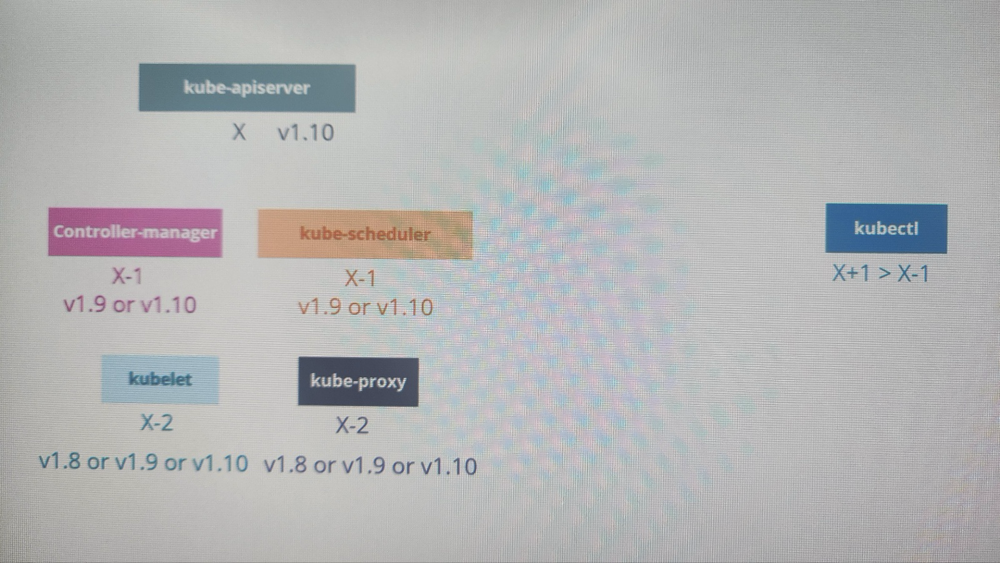

kubectl drain node01 : 기존, 신규 파드를 모두 게저하도록 함
kubectl cordon node01 : 신규 파드가 할당되지 못하도록 함
kubectl uncordon node01 : 신규 파드가 할당될 수 있도록 함



```shell
kubectl get all -A -o yaml > all-resources-backup.yaml
kubectl apply -f all-resources-backup.yaml
```

```shell
ETCDCTL_API=3 etcdctl snapshot save snapshot.db
ETCDCTL_API=3 etcdctl snapshot status snapshot.db
ETCDCTL_API=3 etcdctl snapshot restore snapshot.db --data-dir /var/lib/etcd-from-backup/

systemctl daemon-reload
service etcd restart
service kube-apiserver restart
```
