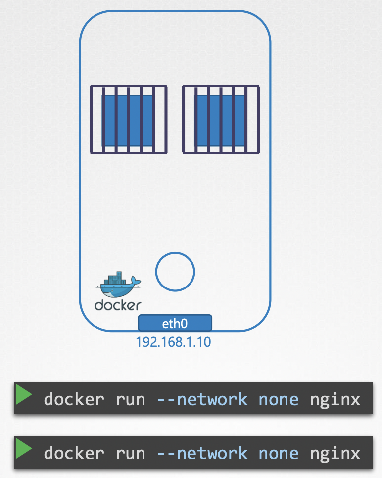
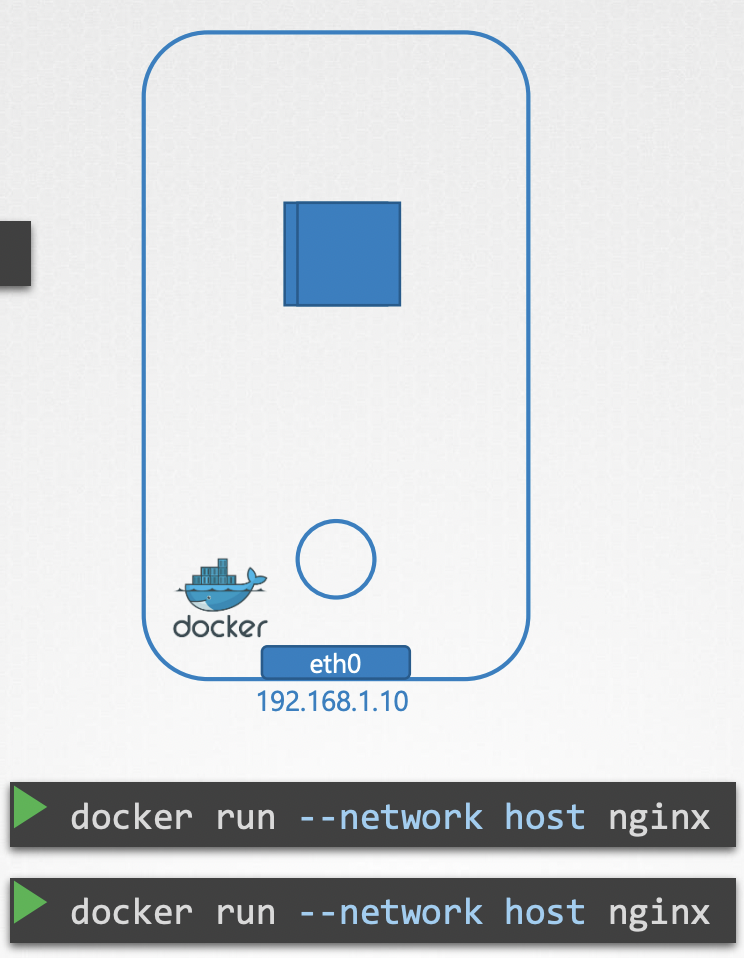
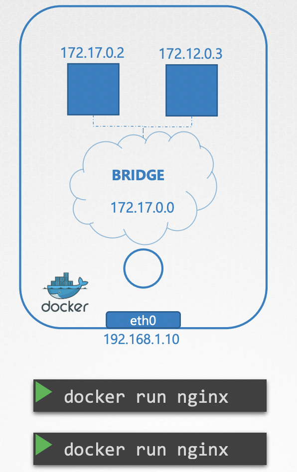

docker run --network none -d -p 80:80 --name nginx_no_host nginx

docker run --network host -d -p 80:80 --name nginx_host nginx

docker run --network bridge -d -p 80:80 --name nginx_bridge nginx

