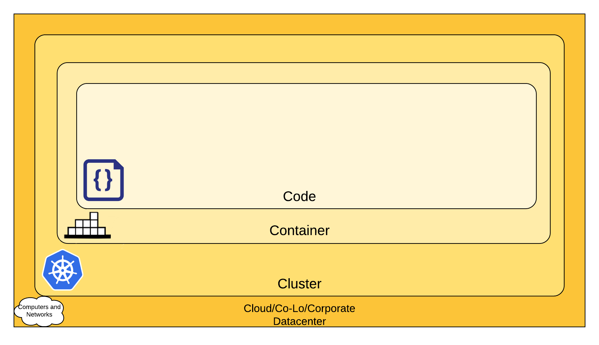

Cloud Natvie 보안은 4C 계층(Clud, Cluster, Container, Code)으로 구성된다.  
따라서 내부 계층은 외부 계층의 보안을 그대로 이어받는 [심층 컴퓨팅[1]](<https://en.wikipedia.org/wiki/Defense_in_depth_(computing)>)

> - [1] Defense in depth computing

즉, 외부 계층의 보안이 안전할 것이라고 믿는 [신뢰 컴퓨팅 기반[2]](https://en.wikipedia.org/wiki/Trusted_computing_base)에 의거한다.  
따라서 여기서 클라우드 공급사 레벨의 보안은 그 주제로서 다루지 않겠습니다. **_당장은..._**

> - [2] Trusted computing base

4C 중 두 번째인 Cluster에 대한 보안 제안은 다음과 같이 구분된다.

1. Control Plane에 대한 접근 제어 : 외부에서 직접적으로 Cluster에 접속하지 못하도록 할 것
2. Worker Node에 대한 접근 제어 : NodePort, LoadBalancer 유형만 외부에서 찌를 수 있도록 조치할 것
3. 클라우드 공급자 API에 대한 쿠버네티스 접근 : [최소권한의 원칙](https://en.wikipedia.org/wiki/Principle_of_least_privilege) 준수할 것
4. ETCD에 대한 접근 : ETCD의 접근은 Control Plane에서만 할 수 있을 것
5. ETCD의 암호화 : ETCD 기록은 암호화해서 기록할 것
   - 암호화하지 않으면 ConfigMap, Secret 등을 dump 떠서 볼 수 있다.
